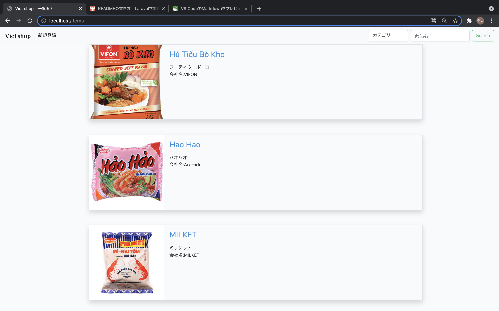

# ベトナム食品App

## About this app
---
* ベトナムの商品を気軽にCRUDできるアプリ
* 通販サイトを作成する予定でしたが、今回は買い物カゴ機能の様なものはございません。
* 初期データとして、複数の商品をSeederで登録しています。

## テーブル定義
---

* アイテムカテゴリtable・・・麺や調味料などのアイテムのカテゴリ情報を格納
* アイテムtable・・・各アイテムの情報を格納、アイテムカテゴリtableへの外部キーあり

## 実装機能
---

* CRUD
  * 各商品がCRUDできるようになっています
バリデーションも実装済

* 検索
  * アイテム名、カテゴリー名から、検索できるようになってます

* ファイルアップロード
   * 商品の画像は、ファイルアップロードできるようにしました
ファイルアップロードするとき、画面上にプレビュー画像が表示されるようにしました
アップロードした画像は、/storage/app/public/item_images配下に保存

## プラスαで工夫した点
---

商品詳細の説明文の改行、値段の数字に3桁ごとにカンマを挿入するようにしました。

## 画面
---
一覧画面

新規登録画面

詳細画面

編集画面

